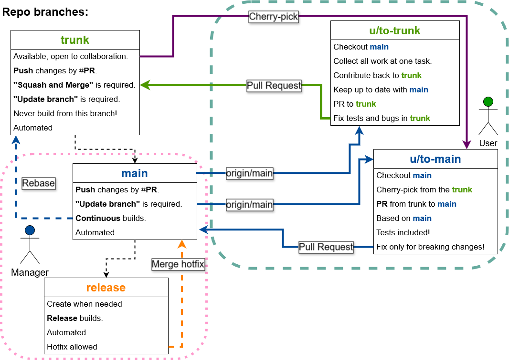

# Trunk

It can be `pre`, `dev`, `qa` or anything.

## Trunk origins and lifecycle

- The branch `trunk` is created from the `main`, once.
- Users should create personal branches from the `main`, but merge via **#PR** into the `trunk`.
- **#PR** into the `trunk` requires teammates approval only!

## Move changes from 'trunk' to 'main'

- Tests must pass in `trunk` 
  - user creates branch `from-trunk-to-main` based on the `main` branch.
  - user creates a **#PR** into the `main` by cherry-picking from the `trunk`.
  - system attaches test results to this **#PR** and external review can be initiated.
  - **#PR** from the `trunk` into the `main` requires core team or manager approvals.
- User "Squash and Merge" his **#PR** into the `main`.

## The main branch receiving merge commits from trunk

Everyhing is already tested in the `trunk` reviewed and approved.

- As soon as `main` is full of features we need to release now - create a `release` branch.
  - The `release` branch is now detached from the main.
  - The `release` branch can receive only hotfixes if build fails!
  - Release branch should be merged back to `main` if there were any hotfixes.

## The release is ready and finished:

- Create a `release` package in the repo based on the `release` branch and assign the tag: `0.0.1`
  - Use this tag point as a useful diff to compare releases and see the history.
  - the `main` branch rebases back into the `trunk`
    - The `main` branch may also include `hotfixes` from the release branch.

## Issues:

- Branch `trunk` is N commits **ahead** of main.
  - Since we does not care about trunk history - we use `rebase` option to attach `trunk` to the `main` changes and run `push --force` to alter any stuck commits at `trunk`.
  - It's only a solution for the situation wen `trunk` to `main` diff shows: `Showing with 0 additions and 0 deletions.` In such case we can halt PRs into the trunk or merge important **#PRs** from `trunk` to the `main` and later `rebase` with `push --force` again.

- Branch `trunk` is N commits **behind** of main.
  - It's not an issue, this is actually shows that the `main` branch hasn't recieved some commits from the `trunk` yet.
  - User or manager must create a #PR from `trunk` into the `main` using `main` as the base. (checkout `main`, cherrypick from `trunk` - merge into the `main`)
    - Cherry-pick the commits that have an actual diff.
    - Optionally: Just merge everything, and decide to `rebase`, `merge`, or `squash`.
      - `Rebase` will save users commit formats and messages as they were in 'trunk`.
  - Repeate the diff again, untill **behind** dissapears.

## Disaster:

- The branch `trunk` can be deleted and recreated if complications occur.
- We do not care if history of the `trunk` is inconsistent, but we should have `main` to be equal to `trunk` after each release!

# Drawing:

